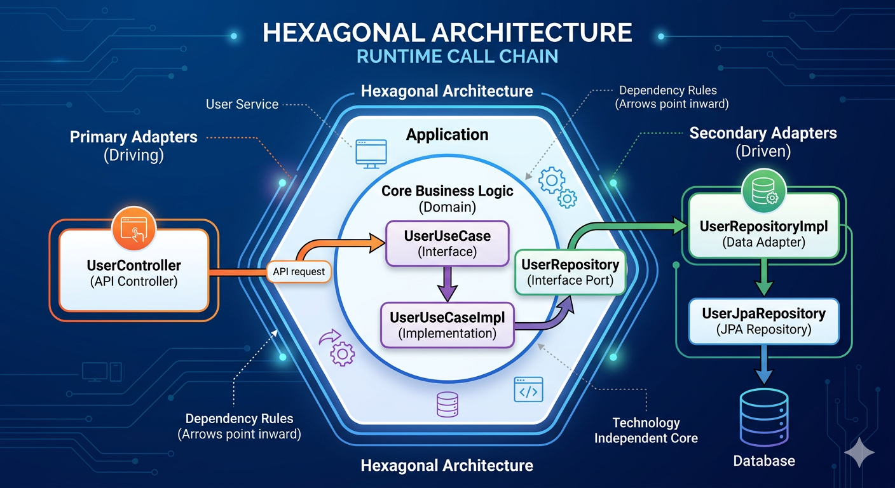
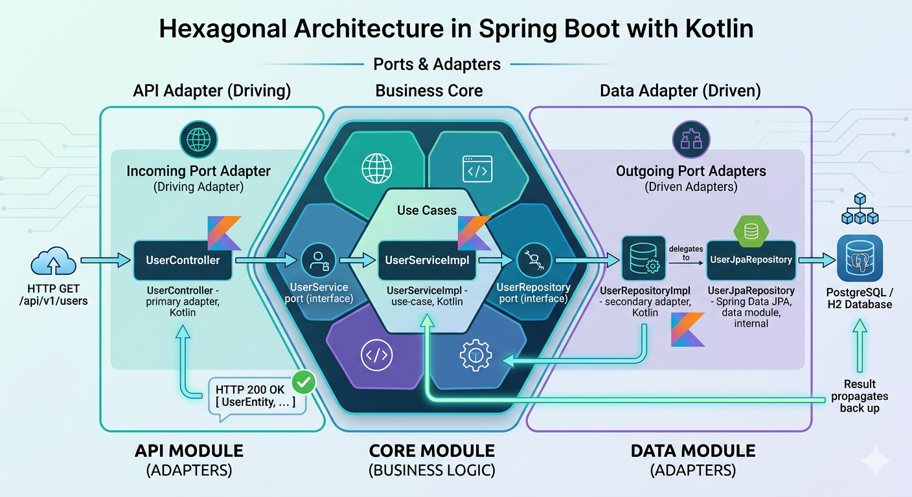
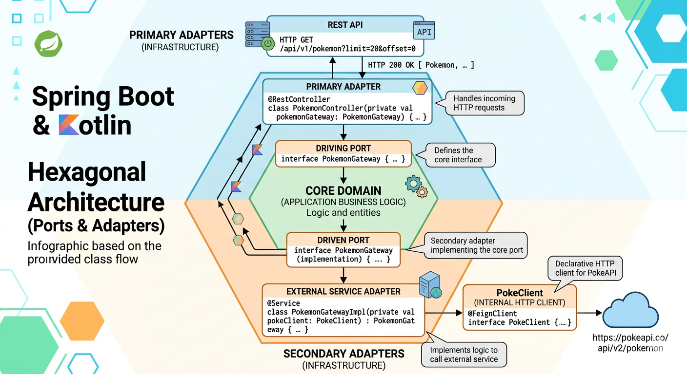

# Hexagonal Architecture in Practice: A Spring Boot + Kotlin Example

## Introduction

If you've ever found your business logic tangled up with Spring annotations or JPA types, **Hexagonal Architecture** (also known as Ports and Adapters) is the cure. Introduced by Alistair Cockburn in 2005, it separates the core domain from all technical details — databases, HTTP, external APIs — so they can evolve independently.

This article walks through a practical Spring Boot + Kotlin implementation, examining the code organization, design decisions, and the benefits of adopting this architecture.

## What is Hexagonal Architecture?

Hexagonal Architecture is an architectural pattern that separates the core business logic of an application from external technical details such as databases, user interfaces, or external services. It's visualized as a hexagon with:

- **Core Domain** at the center: containing business rules and logic
- **Ports**: interfaces allowing communication with the application
- **Adapters**: specific implementations of ports, connecting the domain with the outside world


## Feature-Based Organization in Hexagonal Architecture

A key strength of Hexagonal Architecture is how it supports feature-based organization of code. Rather than organizing by technical layers (controllers, services, repositories), we organize primarily by business features or domains.

Our sample project structure illustrates this approach:

```
hexagon-app/
├── api/                                # API Module (Primary Adapters)
│   └── src/main/kotlin/com/hieunv/app/
│       ├── App.kt                      # Main application class
│       ├── user/                       # User feature REST controllers
│       └── pokemon/                    # Pokemon feature REST controllers
├── core/                               # Core Module (Domain & Ports)
│   └── src/main/kotlin/com/hieunv/app/core/
│       ├── entity/                     # Shared domain logic/entities
│       ├── user/                       # User domain model, ports, and use-cases
│       └── pokemon/                    # Pokemon domain model and ports
├── data/                               # Data Module (Secondary Adapters - DB)
│   └── src/main/kotlin/com/hieunv/app/data/
│       └── user/
│           ├── UserJpaRepository.kt    # Spring Data JPA interface
│           └── UserRepositoryImpl.kt   # Implements core's UserRepository port
├── gw/                                 # Gateway Module (Secondary Adapters - External APIs)
│   └── src/main/kotlin/com/hieunv/gw/
│       ├── client/                     # API client implementations
│       └── pokemon/                    # Pokemon gateway implementations
```

Notice how each feature is represented across multiple modules, maintaining the hexagonal boundaries while keeping related functionality grouped by feature.

## Detailed Analysis of Each Module

### 1. Core Module - The Heart of the Architecture

The Core module is the heart of the application, containing business logic and domain entities. In our implementation, we use JPA annotations in our core module for simplicity, though in stricter DDD implementations, these might be separated.

Let's look at our base entity class and user entity:

```kotlin
// core/src/main/kotlin/com/hieunv/app/core/entity/SystemEntity.kt
package com.hieunv.app.core.entity

import jakarta.persistence.Column
import jakarta.persistence.Id
import jakarta.persistence.MappedSuperclass
import java.time.LocalDateTime
import java.util.UUID

@MappedSuperclass
open class SystemEntity(
    @Id val id: String = UUID.randomUUID().toString(),

    @Column(nullable = false, name = "created_at") val createdAt: LocalDateTime = LocalDateTime.now(),

    @Column(nullable = false, name = "updated_at") var updatedAt: LocalDateTime = LocalDateTime.now(),

    @Column(nullable = false, name = "deleted_at") var deletedAt: LocalDateTime = LocalDateTime.now(),
)
```

```kotlin
// core/src/main/kotlin/com/hieunv/app/core/user/UserEntity.kt
package com.hieunv.app.core.user

import com.hieunv.app.core.entity.SystemEntity
import jakarta.persistence.Column
import jakarta.persistence.Entity
import jakarta.persistence.Table

@Entity
@Table(name = "users")
class UserEntity(
    @Column(nullable = false, unique = true) val username: String = "",

    @Column(nullable = false) var password: String = "",

    @Column(nullable = false) var enabled: Boolean = true,

    ) : SystemEntity()
```

Next, we define the repository interface — the **port** through which the domain expresses its data needs:

```kotlin
// core/src/main/kotlin/com/hieunv/app/core/user/UserRepository.kt
package com.hieunv.app.core.user

interface UserRepository {
    fun findAll(): List<UserEntity>
}
```

In this implementation, we go a step further by introducing a **Service (Use-Case) layer** within the core module. This layer orchestrates the domain logic:

```kotlin
// core/src/main/kotlin/com/hieunv/app/core/user/UserService.kt
package com.hieunv.app.core.user

interface UserService {
  fun findAll(): List<UserEntity>
}
```

```kotlin
// core/src/main/kotlin/com/hieunv/app/core/user/UserServiceImpl.kt
package com.hieunv.app.core.user

import org.springframework.stereotype.Component

@Component
class UserServiceImpl(
  private val userRepository: UserRepository
) : UserService {
  override fun findAll(): List<UserEntity> {
    return userRepository.findAll()
  }
}
```

### 2. Data Module - Secondary Adapter

The Data module is responsible for implementing repository interfaces defined in the core module. This module connects the domain to the database.

**Step 1 — `UserJpaRepository`**: A Spring Data JPA interface. Note that the ID is stored as a `String` (generated via `UUID.randomUUID().toString()`), and the JPA repository is typed with `String` as the second generic parameter.

```kotlin
// data/src/main/kotlin/com/hieunv/app/data/user/UserJpaRepository.kt
package com.hieunv.app.data.user

import com.hieunv.app.core.user.UserEntity
import org.springframework.data.jpa.repository.JpaRepository
import org.springframework.stereotype.Repository

@Repository
interface UserJpaRepository : JpaRepository<UserEntity, String> {
    override fun findAll(): List<UserEntity>
}
```

**Step 2 — `UserRepositoryImpl`**: The actual **secondary adapter** — the glue between the domain port and Spring Data JPA.

```kotlin
// data/src/main/kotlin/com/hieunv/app/data/user/UserRepositoryImpl.kt
package com.hieunv.app.data.user

import com.hieunv.app.core.user.UserEntity
import com.hieunv.app.core.user.UserRepository
import org.springframework.stereotype.Component

@Component
class UserRepositoryImpl(
    private val userJpaRepository: UserJpaRepository
) : UserRepository {

    override fun findAll(): List<UserEntity> {
        return userJpaRepository.findAll()
    }

}
```

### 3. API Module - Primary Adapter

The API module contains controllers that handle HTTP requests. It interacts with the core through the `UserService` port.

```kotlin
// api/src/main/kotlin/com/hieunv/app/user/UserController.kt
package com.hieunv.app.user

import com.hieunv.app.core.user.UserEntity
import com.hieunv.app.core.user.UserService
import org.springframework.web.bind.annotation.GetMapping
import org.springframework.web.bind.annotation.RequestMapping
import org.springframework.web.bind.annotation.RestController

@RestController
@RequestMapping("/api/v1/users")
class UserController(
  private val userService: UserService
) {
  @GetMapping
  fun getAllUsers(): List<UserEntity> {
    val users = userService.findAll()
    return users
  }
}
```

> **Note:** In a real-world scenario, returning a domain entity (`UserEntity`) containing JPA annotations and database fields (like `deletedAt` and `password`) directly from the API controller is a leaky abstraction. A better practice is to map the domain entity to a Data Transfer Object (DTO) before returning it, keeping persistence details hidden from the API consumers.

The runtime call chain flows as follows:
`UserController` (API) -> `UserService` (Core) -> `UserServiceImpl` (Core implements UserService) -> `UserRepository` (Core Port) -> `UserRepositoryImpl` (Data Adapter implements UserRepository) -> `UserJpaRepository` (JPA) -> Database.



### 4. Gateway Module - Secondary Adapter for External Services

The Gateway module implements interfaces defined in the core for interacting with external services, like the PokeAPI.

First, the domain model and port interface live in the core:

```kotlin
// core/src/main/kotlin/com/hieunv/app/core/pokemon/Pokemon.kt
package com.hieunv.app.core.pokemon

/**
 * Data class representing a Pokémon.
 *
 * @code {
 *   {
 *     "name": "bulbasaur",
 *     "url": "https://pokeapi.co/api/v2/pokemon/1/"
 *   }
 * }
 */
data class Pokemon(
    val name: String = "", val url: String = ""
)
```

```kotlin
// core/src/main/kotlin/com/hieunv/app/core/pokemon/PokemonGateway.kt
package com.hieunv.app.core.pokemon

interface PokemonGateway {
    /**
     * Fetches a list of Pokémon.
     *
     * @param limit the maximum number of Pokémon to return
     * @param offset the offset for pagination
     * @return a list of Pokémon
     */
    fun fetchPokemonList(limit: Int, offset: Int): List<Pokemon?>?
}
```

For handling the paginated API response, we have a generic wrapper class in the `gw` module:

```kotlin
// gw/src/main/kotlin/com/hieunv/gw/client/Poke.kt
package com.hieunv.gw.client

/**
 * Data class representing a Poke API response.
 *
 * @code {
 * {
 *   "count": 1302,
 *   "next": "https://pokeapi.co/api/v2/pokemon?offset=20&limit=20",
 *   "previous": null,
 *   "results": [
 *     {
 *       "name": "bulbasaur",
 *       "url": "https://pokeapi.co/api/v2/pokemon/1/"
 *     },
 *     {
 *       "name": "ivysaur",
 *       "url": "https://pokeapi.co/api/v2/pokemon/2/"
 *     }
 *   ]
 * }
 */
data class Poke<T>(
    val count: Int = 0,
    val next: String? = null,
    val previous: String? = null,
    val results: List<T> = emptyList()
)
```

A generic HTTP client handles the actual REST calls:

```kotlin
// gw/src/main/kotlin/com/hieunv/gw/client/PokeClient.kt
package com.hieunv.gw.client

import org.springframework.boot.web.client.RestTemplateBuilder
import org.springframework.core.ParameterizedTypeReference
import org.springframework.http.HttpMethod
import org.springframework.stereotype.Component
import org.springframework.web.client.RestTemplate

@Component
class PokeClient(private val restTemplateBuilder: RestTemplateBuilder) {
    private val restTemplate: RestTemplate = restTemplateBuilder.build();

    operator fun <T> get(url: String, responseType: ParameterizedTypeReference<T>): T? {
        return try {
            val response = restTemplate.exchange(url, HttpMethod.GET, null, responseType)
            response.body
        } catch (e: Exception) {
            e.printStackTrace()
            null
        }
    }
}
```

> Using `RestTemplateBuilder` instead of injecting `RestTemplate` directly ensures a properly configured instance (timeouts, message converters, etc.) set up by Spring Boot's auto-configuration.

The gateway implementation in the `gw` module bridges the core port and the HTTP client:

```kotlin
// gw/src/main/kotlin/com/hieunv/gw/pokemon/PokemonGateway.kt
package com.hieunv.gw.pokemon

import com.hieunv.app.core.pokemon.Pokemon
import com.hieunv.app.core.pokemon.PokemonGateway as CorePokemonGateway
import com.hieunv.gw.client.Poke
import com.hieunv.gw.client.PokeClient
import org.springframework.core.ParameterizedTypeReference
import org.springframework.stereotype.Service

@Service
class PokemonGateway(private val pokeClient: PokeClient) : CorePokemonGateway {

    override fun fetchPokemonList(
        limit: Int, offset: Int
    ): List<Pokemon?>? {
        return pokeClient.get(
            "https://pokeapi.co/api/v2/pokemon?limit=$limit&offset=$offset",
            object : ParameterizedTypeReference<Poke<Pokemon>>() {})?.let { response ->
            return response.results.map { it }
        }
    }
}
```

Finally, the primary adapter exposes the feature via REST:

```kotlin
// api/src/main/kotlin/com/hieunv/app/pokemon/PokemonController.kt
package com.hieunv.app.pokemon

import com.hieunv.app.core.pokemon.Pokemon
import com.hieunv.app.core.pokemon.PokemonGateway
import org.springframework.web.bind.annotation.GetMapping
import org.springframework.web.bind.annotation.PathVariable
import org.springframework.web.bind.annotation.RequestMapping
import org.springframework.web.bind.annotation.RequestParam
import org.springframework.web.bind.annotation.RestController

@RestController
@RequestMapping("/api/v1/pokemon")
class PokemonController(
    private val pokemonGateway: PokemonGateway
) {
    /**
     * Get a list of Pokemon with pagination support
     *
     * @param limit maximum number of Pokemon to return (default: 20)
     * @param offset the offset for pagination (default: 0)
     * @return a list of Pokemon
     */
    @GetMapping
    fun getPokemonList(
        @RequestParam(defaultValue = "20") limit: Int,
        @RequestParam(defaultValue = "0") offset: Int
    ): List<Pokemon> {
        return pokemonGateway.fetchPokemonList(limit, offset)?.filterNotNull() ?: emptyList()
    }
}
```

## Module Dependency Overview

Before tracing the data flow, it helps to visualize how our modules depend on each other:

The `core` module has **zero dependencies** on other application modules (`api`, `gw`, `data`) — it is the stable center. All other modules depend on core, never the other way around. 

> **Note:** In a strict DDD implementation, the core domain would also have zero dependencies on external frameworks. However, for pragmatic reasons, this sample project allows Spring context annotations (`@Component`) and JPA annotations (`@Entity`, `@MappedSuperclass`) in the core domain to reduce boilerplate and mappings. This is a common shortcut known as "Pragmatic Hexagonal Architecture."

## Data Flow in Hexagonal Architecture

Our two features demonstrate both flavours of secondary adapter: a **database adapter** and an **external API adapter**.

### Flow 1 — `GET /api/v1/users` (Database)

```
HTTP GET /api/v1/users
    │
    ▼
UserController              ← primary adapter  (api module)
    │  calls UserService port (core)
    ▼
UserServiceImpl             ← use-case         (core module)
    │  calls UserRepository port (core)
    ▼
UserRepositoryImpl          ← secondary adapter (data module)
    │  delegates to
    ▼
UserJpaRepository           ← Spring Data JPA   (data module, internal)
    │
    ▼
 PostgreSQL / H2 Database
    │
    ▼  (result propagates back up)
HTTP 200 OK  [ UserEntity, … ]
```



### Flow 2 — `GET /api/v1/pokemon` (External API)

```
HTTP GET /api/v1/pokemon?limit=20&offset=0
    │
    ▼
PokemonController           ← primary adapter   (api module)
    │  calls PokemonGateway port (core)
    ▼
PokemonGateway (impl)       ← secondary adapter (gw module)
    │  uses
    ▼
PokeClient                  ← HTTP client        (gw module, internal)
    │
    ▼
 https://pokeapi.co/api/v2/pokemon
    │
    ▼  (result propagates back up)
HTTP 200 OK  [ Pokemon, … ]
```



In both cases the **primary adapter** (controller) only ever references the **core port** — it has no knowledge of whether data comes from a database, a remote API, or an in-memory stub. That is the key insight of hexagonal architecture.

## Benefits of Hexagonal Architecture

1. **High Maintainability**: Business logic is separated from technical details, making it easier to understand and maintain.
2. **Technology Agnosticism**: You can change the database, UI, or framework without affecting the domain.
3. **Excellent Testability**: The domain can be tested independently, without setting up a database or UI.
4. **Parallel Development**: Teams can work in parallel on different parts of the application.
5. **Flexibility**: Easy to add new adapters for new technologies or communication channels.

## When to Use Hexagonal Architecture

Hexagonal Architecture is especially useful for:

- Complex applications with many business rules
- Long-lived projects that must be easy to maintain
- Systems with multiple interfaces (REST API, GraphQL, UI...)
- When you want to ensure domain logic isn't polluted by technical details

However, for smaller applications or prototypes, this architectural pattern might be overkill.

## Conclusion

Hexagonal Architecture provides a structured approach to organizing code, separating the core domain from technical details. Our sample project with four clear modules — **api**, **core**, **data**, and **gw** — demonstrates how to implement this pattern in practice, with an emphasis on feature-based organization.

The `core` module defines what the application *is* (domain entities and port interfaces). The `api`, `data`, and `gw` modules define how the application *connects* to the outside world (primary and secondary adapters). Nothing in `core` ever depends on the other modules, which is what makes the architecture resilient to change.

The main benefits are maintainability, adaptability to change, and excellent testability. However, it requires some initial setup effort and team discipline to consistently respect the port/adapter boundaries.

If you're developing a complex application with high requirements for maintenance and scalability, and you value organizing code by features rather than technical layers, Hexagonal Architecture is definitely worth considering.

---

*References:*
1. [Alistair Cockburn - Hexagonal Architecture](https://alistair.cockburn.us/hexagonal-architecture/)
2. [DDD, Hexagonal, Onion, Clean, CQRS, … How I put it all together](https://herbertograca.com/2017/11/16/explicit-architecture-01-ddd-hexagonal-onion-clean-cqrs-how-i-put-it-all-together/)
3. [Spring Boot Documentation](https://spring.io/projects/spring-boot)
4. [Kotlin Documentation](https://kotlinlang.org/docs/home.html)
