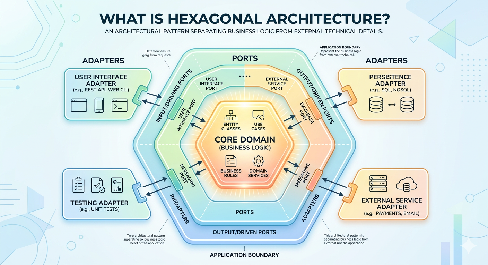
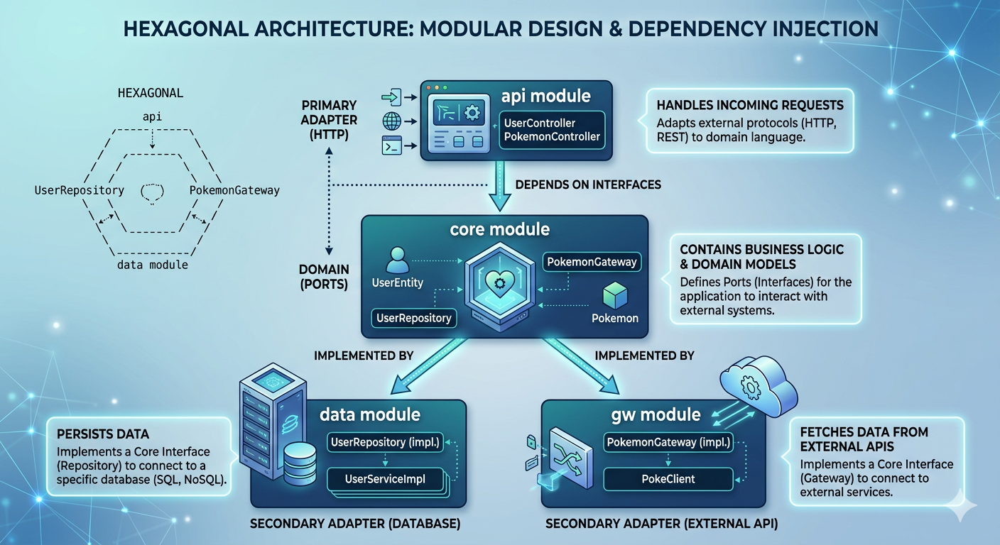

# Hexagonal Architecture in Practice: A Spring Boot + Kotlin Example

## Introduction

If you've ever found your business logic tangled up with Spring annotations or JPA types, **Hexagonal Architecture** (also known as Ports and Adapters) is the cure. Introduced by Alistair Cockburn in 2005, it separates the core domain from all technical details — databases, HTTP, external APIs — so they can evolve independently.

This article walks through a practical Spring Boot + Kotlin implementation, examining the code organization, design decisions, and the benefits of adopting this architecture.

## What is Hexagonal Architecture?

Hexagonal Architecture is an architectural pattern that separates the core business logic of an application from external technical details such as databases, user interfaces, or external services. It's visualized as a hexagon with:

- **Core Domain** at the center: containing business rules and logic
- **Ports**: interfaces allowing communication with the application
- **Adapters**: specific implementations of ports, connecting the domain with the outside world



## Feature-Based Organization in Hexagonal Architecture

A key strength of Hexagonal Architecture is how it supports feature-based organization of code. Rather than organizing by technical layers (controllers, services, repositories), we organize primarily by business features or domains.

Our sample project structure illustrates this approach:

```
hexagon-app/
├── api/                                # API Module
│   └── src/main/kotlin/com/hieunv/app/
│       ├── App.kt                      # Main application class
│       ├── user/                       # User feature REST controllers
│       └── pokemon/                    # Pokemon feature REST controllers
├── core/                               # Core Module
│   └── src/main/kotlin/com/hieunv/app/core/
│       ├── entity/                     # Domain entities
│       ├── user/                       # User domain model and interfaces
│       └── pokemon/                    # Pokemon domain model and interfaces
├── data/                               # Data Module
│   └── src/main/kotlin/com/hieunv/app/data/
│       └── user/
│           ├── UserJpaRepository.kt    # Spring Data JPA interface (internal adapter)
│           └── UserRepositoryImpl.kt   # Implements core's UserRepository port
├── gw/                                 # Gateway Module
│   └── src/main/kotlin/com/hieunv/gw/
│       ├── client/                     # API client implementations
│       └── pokemon/                    # Pokemon gateway implementations
```

Notice how each feature is represented across multiple modules, maintaining the hexagonal boundaries while keeping related functionality grouped by feature.

## Detailed Analysis of Each Module

### 1. Core Module - The Heart of the Architecture

The Core module is the heart of the application, containing business logic and domain entities. In our implementation, we have JPA annotations in our core module for simplicity.

Let's look at our base entity class and user entity:

```kotlin
// core/src/main/kotlin/com/hieunv/app/core/entity/SystemEntity.kt
package com.hieunv.app.core.entity

import jakarta.persistence.Column
import jakarta.persistence.Id
import jakarta.persistence.MappedSuperclass
import java.time.LocalDateTime
import java.util.UUID

@MappedSuperclass
open class SystemEntity(
    @Id val id: String = UUID.randomUUID().toString(),

    @Column(nullable = false, name = "created_at") val createdAt: LocalDateTime = LocalDateTime.now(),

    @Column(nullable = false, name = "updated_at") var updatedAt: LocalDateTime = LocalDateTime.now(),

    // null = not deleted; set to a timestamp when the record is soft-deleted
    @Column(name = "deleted_at") var deletedAt: LocalDateTime? = null,
)
```

```kotlin
// core/src/main/kotlin/com/hieunv/app/core/user/UserEntity.kt
package com.hieunv.app.core.user

import com.hieunv.app.core.entity.SystemEntity
import jakarta.persistence.Column
import jakarta.persistence.Entity
import jakarta.persistence.Table

@Entity
@Table(name = "users")
class UserEntity(
    @Column(nullable = false, unique = true) val username: String = "",

    @Column(nullable = false) var password: String = "",

    @Column(nullable = false) var enabled: Boolean = true,

    ) : SystemEntity()
```

Next, we define the repository interface — the **port** through which the domain expresses its data needs. Notice that this is a pure Kotlin interface with **zero dependency on any JPA or Spring Data types**:

```kotlin
// core/src/main/kotlin/com/hieunv/app/core/user/UserRepository.kt
package com.hieunv.app.core.user

interface UserRepository {
    fun findAll(): List<UserEntity>
}
```

This is an important distinction from an earlier version of the project, where `UserRepository` extended `JpaRepository` directly. By keeping the port free of JPA, the core module has **zero infrastructure dependencies** — it doesn't know (or care) whether the data comes from a relational database, an in-memory store, or a remote service.

### 2. Data Module - Secondary Adapter

The Data module is responsible for implementing repository interfaces defined in the core module. This module connects the domain to the database.

With the core `UserRepository` now a pure domain interface, the Data module uses a **two-class pattern** to bridge the gap between the domain port and the JPA infrastructure:

**Step 1 — `UserJpaRepository`**: A Spring Data JPA interface that handles all ORM/database concerns. It lives entirely inside the `data` module and is never exposed to the core.

```kotlin
// data/src/main/kotlin/com/hieunv/app/data/user/UserJpaRepository.kt
package com.hieunv.app.data.user

import com.hieunv.app.core.user.UserEntity
import org.springframework.data.jpa.repository.JpaRepository
import org.springframework.stereotype.Repository
import java.util.UUID

@Repository
interface UserJpaRepository : JpaRepository<UserEntity, String> {
    override fun findAll(): List<UserEntity>
}
```

> **Note**: No `@Query` needed here — `JpaRepository.findAll()` already fetches all rows. Overriding it with a native SQL query would reduce portability without adding any value.

**Step 2 — `UserRepositoryImpl`**: A `@Component` class that implements the core's `UserRepository` port by delegating to `UserJpaRepository`. This is the actual **secondary adapter** — the glue between the domain and Spring Data JPA.

```kotlin
// data/src/main/kotlin/com/hieunv/app/data/user/UserRepositoryImpl.kt
package com.hieunv.app.data.user

import com.hieunv.app.core.user.UserEntity
import com.hieunv.app.core.user.UserRepository
import org.springframework.stereotype.Component

@Component
class UserRepositoryImpl(
    private val userJpaRepository: UserJpaRepository
) : UserRepository {

    override fun findAll(): List<UserEntity> {
        return userJpaRepository.findAll()
    }

}
```

> **Why two classes?** This is the correct application of hexagonal architecture. `UserJpaRepository` is a pure JPA concern — it knows nothing about the domain port. `UserRepositoryImpl` is the adapter that bridges the two worlds. If you later swap JPA for MongoDB or a REST client, you only replace these two files; the core and all primary adapters remain untouched.

Here's how the runtime call chain flows for a `GET /api/v1/users` request:

```
HTTP Request
    │
    ▼
UserController              ← primary adapter  (api module)
    │  injects UserRepository port (core)
    ▼
UserRepositoryImpl          ← secondary adapter (data module)
    │  delegates to
    ▼
UserJpaRepository           ← Spring Data JPA  (data module, internal)
    │
    ▼
 Database
```

The key insight: `UserController` only knows about the **port** (`UserRepository`). Spring's dependency injection wires in `UserRepositoryImpl` at runtime — this is the **Dependency Inversion Principle** in action.

### 3. API Module - Primary Adapter

The API module contains controllers that handle HTTP requests and responses, acting as the primary adapter in our hexagonal architecture. This module connects external users to our domain.

```kotlin
// api/src/main/kotlin/com/hieunv/app/user/UserController.kt
package com.hieunv.app.user

import com.hieunv.app.core.user.UserEntity
import com.hieunv.app.core.user.UserRepository
import org.springframework.web.bind.annotation.GetMapping
import org.springframework.web.bind.annotation.RequestMapping
import org.springframework.web.bind.annotation.RestController

@RestController
@RequestMapping("/api/v1/users")
class UserController(
    private val userRepository: UserRepository
) {
    @GetMapping
    fun getAllUsers(): List<UserEntity> = userRepository.findAll()
}
```

> **Note**: The controller injects the `UserRepository` **port** defined in the core module — it has no knowledge of `UserRepositoryImpl` or `UserJpaRepository`. Spring's dependency injection wires the concrete adapter at runtime, which is dependency inversion in action.

#### Going Further: Introducing a Use-Case Layer

For simple CRUD, injecting the repository port directly into the controller is fine. But as business logic grows, it is common to introduce a dedicated **use-case interface** in the core module. The controller then drives the use case, which in turn drives the repository — keeping orchestration logic out of both the adapter and the entity.

```kotlin
// core/src/main/kotlin/com/hieunv/app/core/user/GetAllUsersUseCase.kt
package com.hieunv.app.core.user

interface GetAllUsersUseCase {
    fun execute(): List<UserEntity>
}
```

```kotlin
// core/src/main/kotlin/com/hieunv/app/core/user/GetAllUsersUseCaseImpl.kt
package com.hieunv.app.core.user

import org.springframework.stereotype.Service

@Service
class GetAllUsersUseCaseImpl(
    private val userRepository: UserRepository
) : GetAllUsersUseCase {
    override fun execute(): List<UserEntity> = userRepository.findAll()
}
```

The controller would then inject `GetAllUsersUseCase` instead of `UserRepository` directly, and the call chain becomes:

```
HTTP Request
    │
    ▼
UserController          ← primary adapter   (api module)
    │  drives
    ▼
GetAllUsersUseCaseImpl  ← use case          (core module)
    │  calls
    ▼
UserRepositoryImpl      ← secondary adapter (data module)
    │
    ▼
 Database
```

This sample project keeps things simple by skipping the use-case layer, but the pattern is worth adopting once the business logic outgrows a single repository call.

### 4. Gateway Module - Secondary Adapter for External Services

The Gateway module is responsible for implementing interfaces defined in the core module that interact with external services or APIs. This module connects the domain to external systems.

Let's look at how we interact with an external Pokemon API:

```kotlin
// core/src/main/kotlin/com/hieunv/app/core/pokemon/Pokemon.kt
package com.hieunv.app.core.pokemon

/**
 * Data class representing a Pokémon.
 */
data class Pokemon(
    val name: String = "", val url: String = ""
)
```

```kotlin
// core/src/main/kotlin/com/hieunv/app/core/pokemon/PokemonGateway.kt
package com.hieunv.app.core.pokemon

interface PokemonGateway {
    /**
     * Fetches a list of Pokémon.
     *
     * @param limit the maximum number of Pokémon to return
     * @param offset the offset for pagination
     * @return a list of Pokémon
     */
    fun fetchPokemonList(limit: Int, offset: Int): List<Pokemon?>?
}
```

For handling API responses with nested structures, we created a wrapper class:

```kotlin
// gw/src/main/kotlin/com/hieunv/gw/client/Poke.kt
package com.hieunv.gw.client

/**
 * Generic wrapper class for PokeAPI responses with pagination.
 */
data class Poke<T>(
    val count: Int = 0,
    val next: String? = null,
    val previous: String? = null,
    val results: List<T> = emptyList()
)
```

We implemented a generic API client to handle HTTP requests:

```kotlin
// gw/src/main/kotlin/com/hieunv/gw/client/PokeClient.kt
package com.hieunv.gw.client

import org.springframework.boot.web.client.RestTemplateBuilder
import org.springframework.core.ParameterizedTypeReference
import org.springframework.http.HttpMethod
import org.springframework.stereotype.Component
import org.springframework.web.client.RestTemplate

@Component
class PokeClient(private val restTemplateBuilder: RestTemplateBuilder) {
    private val restTemplate: RestTemplate = restTemplateBuilder.build()

    /**
     * Generic GET operator — allows calling `pokeClient.get(url, type)` with full generic type safety.
     */
    operator fun <T> get(url: String, responseType: ParameterizedTypeReference<T>): T? {
        return try {
            val response = restTemplate.exchange(url, HttpMethod.GET, null, responseType)
            response.body
        } catch (e: Exception) {
            e.printStackTrace()
            null
        }
    }
}
```

> Using `RestTemplateBuilder` instead of injecting `RestTemplate` directly gives us a properly configured instance (timeouts, message converters, etc.) set up by Spring Boot's auto-configuration.

Finally, we implemented the Pokemon gateway interface. Notice how it uses `Poke<Pokemon>` as the response type — Spring's `RestTemplate` with `ParameterizedTypeReference` handles the generic deserialization automatically:

```kotlin
// gw/src/main/kotlin/com/hieunv/gw/pokemon/PokemonGateway.kt
package com.hieunv.gw.pokemon

import com.hieunv.app.core.pokemon.Pokemon
import com.hieunv.gw.client.Poke
import com.hieunv.gw.client.PokeClient
import org.springframework.core.ParameterizedTypeReference
import org.springframework.stereotype.Service

@Service
class PokemonGateway(private val pokeClient: PokeClient) : com.hieunv.app.core.pokemon.PokemonGateway {

    override fun fetchPokemonList(
        limit: Int, offset: Int
    ): List<Pokemon?>? {
        return pokeClient.get(
            "https://pokeapi.co/api/v2/pokemon?limit=$limit&offset=$offset",
            object : ParameterizedTypeReference<Poke<Pokemon>>() {})?.results
    }
}
```

In the API module, we created a controller to expose Pokemon data:

```kotlin
// api/src/main/kotlin/com/hieunv/app/pokemon/PokemonController.kt
package com.hieunv.app.pokemon

import com.hieunv.app.core.pokemon.Pokemon
import com.hieunv.app.core.pokemon.PokemonGateway
import org.springframework.web.bind.annotation.GetMapping
import org.springframework.web.bind.annotation.RequestMapping
import org.springframework.web.bind.annotation.RequestParam
import org.springframework.web.bind.annotation.RestController

@RestController
@RequestMapping("/api/v1/pokemon")
class PokemonController(
    private val pokemonGateway: PokemonGateway
) {
    /**
     * Get a list of Pokemon with pagination support
     *
     * @param limit maximum number of Pokemon to return (default: 20)
     * @param offset the offset for pagination (default: 0)
     * @return a list of Pokemon
     */
    @GetMapping
    fun getPokemonList(
        @RequestParam(defaultValue = "20") limit: Int,
        @RequestParam(defaultValue = "0") offset: Int
    ): List<Pokemon> {
        return pokemonGateway.fetchPokemonList(limit, offset)?.filterNotNull() ?: emptyList()
    }
}
```

## Module Dependency Overview

Before tracing the data flow, it helps to visualize how our modules depend on each other:




The `core` module has **zero dependencies** on other modules — it is the stable center. All other modules depend on core, never the other way around.

## Data Flow in Hexagonal Architecture

Our two features demonstrate both flavours of secondary adapter: a **database adapter** and an **external API adapter**. Let's trace each call chain separately.

### Flow 1 — `GET /api/v1/users` (Database)

```
HTTP GET /api/v1/users
    │
    ▼
UserController              ← primary adapter  (api module)
    │  calls UserRepository port (core)
    ▼
UserRepositoryImpl          ← secondary adapter (data module)
    │  delegates to
    ▼
UserJpaRepository           ← Spring Data JPA   (data module, internal)
    │
    ▼
 PostgreSQL / H2 Database
    │
    ▼  (result propagates back up)
HTTP 200 OK  [ UserEntity, … ]
```

### Flow 2 — `GET /api/v1/pokemon` (External API)

```
HTTP GET /api/v1/pokemon?limit=20&offset=0
    │
    ▼
PokemonController           ← primary adapter   (api module)
    │  calls PokemonGateway port (core)
    ▼
PokemonGateway (impl)       ← secondary adapter (gw module)
    │  uses
    ▼
PokeClient                  ← HTTP client        (gw module, internal)
    │
    ▼
 https://pokeapi.co/api/v2/pokemon
    │
    ▼  (result propagates back up)
HTTP 200 OK  [ Pokemon, … ]
```

In both cases the **primary adapter** (controller) only ever references the **core port** — it has no knowledge of whether data comes from a database, a remote API, or an in-memory stub. That is the key insight of hexagonal architecture.

## Benefits of Hexagonal Architecture

1. **High Maintainability**: Business logic is separated from technical details, making it easier to understand and maintain
2. **Technology Agnosticism**: You can change database, UI, or framework without affecting the domain
3. **Excellent Testability**: The domain can be tested independently, without setting up database or UI
4. **Parallel Development**: Teams can work in parallel on different parts of the application
5. **Flexibility**: Easy to add new adapters for new technologies or communication channels

## When to Use Hexagonal Architecture

Hexagonal Architecture is especially useful for:

- Complex applications with many business rules
- Long-lived projects that must be easy to maintain
- Systems with multiple interfaces (REST API, GraphQL, UI...)
- When you want to ensure domain logic isn't polluted by technical details

However, for smaller applications or prototypes, this architectural pattern might be overkill.

## Conclusion

Hexagonal Architecture provides a structured approach to organizing code, separating the core domain from technical details. Our sample project with four clear modules — **api**, **core**, **data**, and **gw** — demonstrates how to implement this pattern in practice, with an emphasis on feature-based organization.

The `core` module defines what the application *is* (domain entities and port interfaces). The `api`, `data`, and `gw` modules define how the application *connects* to the outside world (primary and secondary adapters). Nothing in `core` ever depends on the other modules, which is what makes the architecture resilient to change.

The main benefits are maintainability, adaptability to change, and excellent testability. However, it requires some initial setup effort and team discipline to consistently respect the port/adapter boundaries.

If you're developing a complex application with high requirements for maintenance and scalability, and you value organizing code by features rather than technical layers, Hexagonal Architecture is definitely worth considering.

---

*References:*
1. [Alistair Cockburn - Hexagonal Architecture](https://alistair.cockburn.us/hexagonal-architecture/)
2. [DDD, Hexagonal, Onion, Clean, CQRS, … How I put it all together](https://herbertograca.com/2017/11/16/explicit-architecture-01-ddd-hexagonal-onion-clean-cqrs-how-i-put-it-all-together/)
3. [Spring Boot Documentation](https://spring.io/projects/spring-boot)
4. [Kotlin Documentation](https://kotlinlang.org/docs/home.html)
